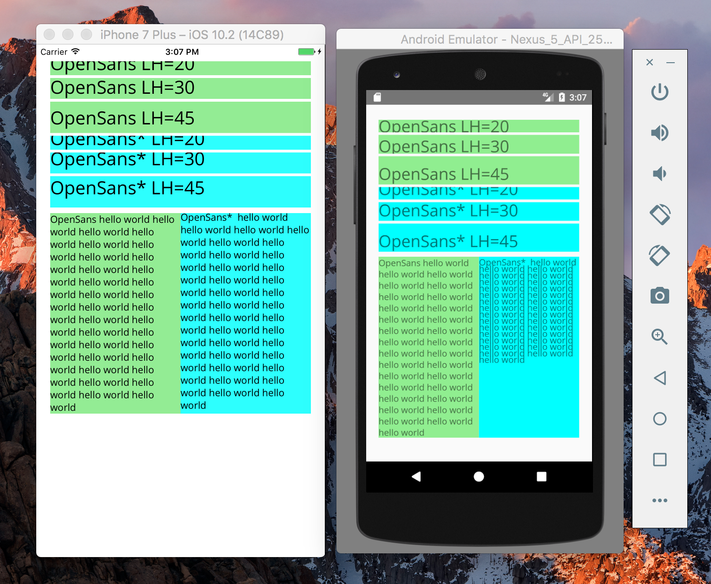

# React Native lineheight bug demo

This is a demo of a bug in React Native on Android displaying line heights. Included is an app that renders OpenSans with various line heights, as well as a modified font where smaller ascent/descent metrics have been set using FontForge.

With the unmodified OpenSans: the font is rendered off center, cutting off descenders.

With modified OpenSans: the font is not cut off but the apparent line height is affected.

Compare with iOS, where the text is vertically centered with the unmodified OpenSans, and the line height is unaffected by ascent/descent metrics.

